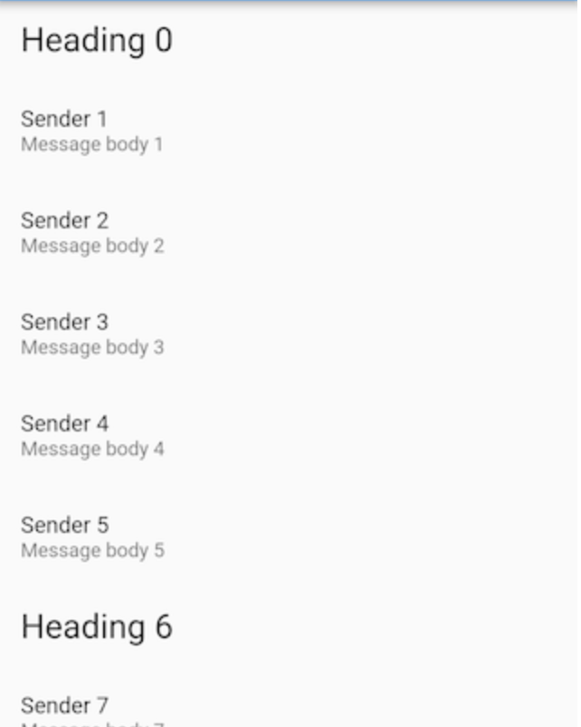

작성자 : gmlwo530

리스트를 만드는 방법들을 공부해봤습니다.

# Vertical List

flutter에는 리스트를 만들 수 있는 `ListView`를 제공해줍니다. 이 위젯을 이용하여 만들어보겠습니다.

ListView는 기본적으로 방향이 *vertical*입니다.

[ListTile](https://api.flutter.dev/flutter/material/ListTile-class.html)은 고정 된 높이를 가지고 있는 행입니다. 텍스트와 아이콘 등을 추가 할 수 있는 속성을 가지고 있습니다.

```dart
ListView(
 children: <Widget>[
   ListTile(
     leading: Icon(Icons.map),
     title: Text('Map'),
   ),
   ListTile(
     leading: Icon(Icons.photo_album),
     title: Text('Album'),
   ),
   ListTile(
     leading: Icon(Icons.phone),
     title: Text('Phone'),
   ),
 ],
);
```

# Horizontal List

만약 수평 리스트를 만들고 싶다면 `scrollDirection` 속성을 사용하면 됩니다.

```dart
ListView(
  // This next line does the trick.
  scrollDirection: Axis.horizontal,
  children: <Widget>[
    Container(
      width: 160.0,
      color: Colors.red,
    ),
    Container(
      width: 160.0,
      color: Colors.blue,
    ),
    Container(
      width: 160.0,
      color: Colors.green,
    ),
    Container(
      width: 160.0,
      color: Colors.yellow,
    ),
    Container(
      width: 160.0,
      color: Colors.orange,
    ),
  ],
)
```

# Grid List

가끔씩 UI를 구성 할 때 Grid에 기반하여 List를 구현하고 싶을 떄도 있다. `GridView`를 통해 Grid List를 구현해보자

List는 기본적으로 수직 방향을 가지고 있으므로 아래의 코드는 열이 2개가 생긴다. 만약 `scrollDirection`을 바꿔주면 행이 2개가 생긴다.

`List.generate()`는 n개의 widget을 생성해준다.

```dart
GridView.count(
  // scrollDirection: Axis.horizontal,
  crossAxisCount: 2,ㄴ
  children: List.generate(100, (index) {
    return Center(
      child: Text(
        'Item $index',
        style: Theme.of(context).textTheme.headline,
      ),
    );
  }),
);
```

# Different types of items List

이번에는 리스트에 item마다 형태가 다른 리스트를 만들어 보겠습니다.

헤더가 있고 헤더에 각각의 item이 있는 형태를 예로 들 수 있습니다.



## 1. 다른 종류의 데이터 만들기

먼저 데이터의 형태를 정의한다.

```dart
abstract class ListItem {}

class HeadingItem implements ListItem {
  final String heading;

  HeadingItem(this.heading);
}

class MessageItem implements ListItem {
  final String sender;
  final String body;

  MessageItem(this.sender, this.body);
}
```

이제 데이터를 만들자.

```dart
final items = List<ListItem>.generate(
  1200,
  (i) => i % 6 == 0
      ? HeadingItem("Heading $i")
      : MessageItem("Sender $i", "Message body $i"),
);
```

---

## 2. 데이터를 List에 넣기

List를 만들기 위해 [ListView.builder()](https://api.flutter.dev/flutter/widgets/ListView/ListView.builder.html) constructor를 사용한다.

builder는 오직 화면에 보여지는 item들만 호출하기 때문에 굉장히 많은(또는 무제한) 데이터를 다룰 떄 사용하기 적합하다.

_note : ListView.builder by default does not support child reordering. If you are planning to change child order at a later time, consider using ListView or ListView.custom._

그리고 어떤 타입의 데이터인지 `is` 키워드를 사용해서 구분한다.

```dart
ListView.builder(
  itemCount: items.length,
  itemBuilder: (context, index) {
    final item = items[index];

    if (item is HeadingItem) {
      return ListTile(
        title: Text(
          item.heading,
          style: Theme.of(context).textTheme.headline,
        ),
      );
    } else if (item is MessageItem) {
      return ListTile(
        title: Text(item.sender),
        subtitle: Text(item.body),
      );
    }
  },
);
```

# Click List Item

리스트의 아이템을 클릭해야하는 하는 상황이 자주 생길 것이다.

위에 예제에 추가해보았다.

## ListTile을 사용 할 때

`onTap()`또는 `onLongTouch` 콜백을 사용하면 된다.

```dart
ListView(
 children: <Widget>[
   ListTile(
     leading: Icon(Icons.map),
     title: Text('Map'),
     onTap: () {
       print('Map');
     }
   ),
   ListTile(
     leading: Icon(Icons.photo_album),
     title: Text('Album'),
     onTap: () {
       print('Album');
     }
   ),
   ListTile(
     leading: Icon(Icons.phone),
     title: Text('Phone'),
     onTap: () {
       print('Phone');
     }
   ),
 ],
);
```

## ListTile를 사용하지 않을 때

[GestureDector](https://api.flutter.dev/flutter/widgets/GestureDetector-class.html) 위젯을 사용하자.

이 위젯을 item view에 감싸주면 된다.

```dart
ListView.builder(
  itemCount: items.length,
  itemBuilder: (context, index) {
    final item = items[index];

    return GestureDetector(
      onTap: () {
        print('click!');
      },
      child: Container(
        color: Colors.yellow,
        child: Text('Box'),
      ),
    )
  },
);
```

**Reference**

- https://flutter.dev/docs/cookbook/lists/basic-list
- https://flutter.dev/docs/cookbook/lists/horizontal-list
- https://flutter.dev/docs/cookbook/lists/grid-lists
- https://flutter.dev/docs/cookbook/lists/mixed-list
- https://pusher.com/tutorials/flutter-listviews#styling
